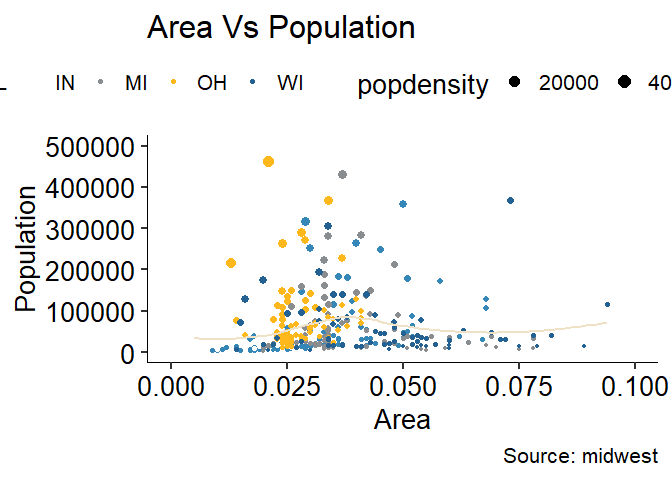
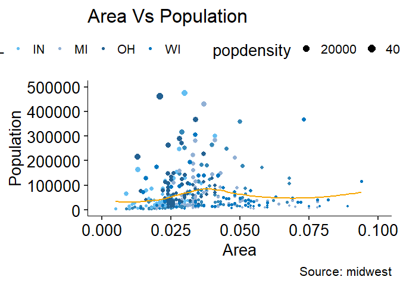
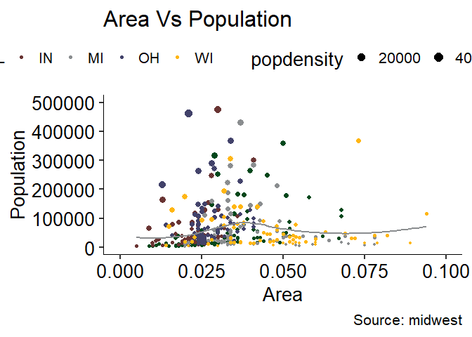

<!-- README.md is generated from README.Rmd. Please edit that file -->

# themeatsu

<!-- badges: start -->
<!-- badges: end -->

The goal of themeatsu is to create a standard theme for statistical
analysis reports done at AT Still University department of Research
Support.

## Installation

You can install the development version of themeatsu from
[GitHub](https://github.com/) with:

``` r
# install.packages("devtools")
devtools::install_github("brunkgr2/themeatsu")
```

## Example 1

This is a basic example which shows you how to use ATSU colors:

``` r
library(themeatsu)
library(ggplot2)
options(scipen=999)
data("midwest", package = "ggplot2")
theme_set(theme_atsu())

gm <- ggplot(midwest, 
             aes(x=area, 
                 y=poptotal)) + 
     geom_point(aes(col=state, 
                    size=popdensity)) + 
     geom_smooth(method="loess", 
                 se=F, 
                 col = rand_pal(1)) + 
  xlim(c(0, 0.1)) + 
  ylim(c(0, 500000)) + 
     labs(title="Area Vs Population", 
          y="Population", 
          x="Area", 
          caption="Source: midwest") +
 scale_color_atsu(palette = "main", 
                  discrete = TRUE)

plot(gm)
#> `geom_smooth()` using formula 'y ~ x'
#> Warning: Removed 15 rows containing non-finite values (stat_smooth).
#> Warning: Removed 15 rows containing missing values (geom_point).
```



``` r
gb <- ggplot(midwest, 
             aes(x=area, 
                 y=poptotal)) + 
     geom_point(aes(col=state, 
                    size=popdensity)) + 
     geom_smooth(method="loess",
                 se=F, 
                 col = rand_pal(1)) + 
  xlim(c(0, 0.1)) + 
  ylim(c(0, 500000)) + 
     labs(title="Area Vs Population", 
          y="Population", 
          x="Area",
          caption="Source: midwest") +
 scale_color_atsu(palette = "blues",
                  discrete = TRUE)

plot(gb)
#> `geom_smooth()` using formula 'y ~ x'
#> Warning: Removed 15 rows containing non-finite values (stat_smooth).
#> Removed 15 rows containing missing values (geom_point).
```



``` r
gg <- ggplot(midwest, 
             aes(x=area,
                 y=poptotal)) + 
     geom_point(aes(col=state, 
                    size=popdensity)) + 
     geom_smooth(method="loess", 
                 se=F, 
                 col = rand_pal(1)) + 
  xlim(c(0, 0.1)) + 
  ylim(c(0, 500000)) + 
     labs(title="Area Vs Population", 
          y="Population", 
          x="Area", 
          caption="Source: midwest") +
 scale_color_atsu(palette = "mke", 
                  discrete = TRUE)

plot(gg)
#> `geom_smooth()` using formula 'y ~ x'
#> Warning: Removed 15 rows containing non-finite values (stat_smooth).
#> Removed 15 rows containing missing values (geom_point).
```



## Example 2

This is a basic example which shows you how to use fix_names():

``` r
library(themeatsu)
data(iris)
names(iris)
#> [1] "Sepal.Length" "Sepal.Width"  "Petal.Length" "Petal.Width"  "Species"
names(iris) <- fix_names(names(iris), 
                         patterns = c("."), 
                         replacements = c("_"), 
                         case = "lower")

names(iris)
#> [1] "sepal_length" "sepal_width"  "petal_length" "petal_width"  "species"
```
